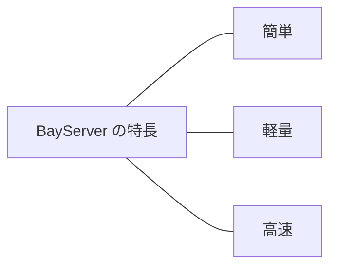

# はじめに

**BayServer** は横浜ベイキットが開発・公開しているオープンソースの Web / Proxy サーバです。

## 何をするものか

BayServer は **Web ブラウザからの HTTP リクエスト** を受け取り、設定に従って:

- **静的ファイル** (HTML / 画像 / CSS / JS) を配信
- **動的アプリ** (Servlet / Rack / WSGI / PHP 等) を実行
- **別のサーバ** (Tomcat / PHP-FPM / 任意の HTTP サーバ) へ **リバースプロキシ**

を行います。

立ち位置としては Apache HTTPD や Nginx と同じカテゴリですが、後述の **設計目標** に基づいてゼロから書き起こされていて、**シンプルな設定** と **複数のプログラミング言語実装** が用意されている点が他と違います。

## どんなときに使うか

- Apache / Nginx の代替として、Web サイトのフロントに立てる
- 既存の Servlet / Rack / WSGI / PHP アプリの前段に置いて、TLS 終端 + 静的配信 + リバプロをまとめる
- Tomcat / PHP-FPM 等の代わりに、アプリを直接ホスト
- 設定をシンプルに保ちたい、Web サーバの設定で消耗したくない

## 設計目標 (= 3 つの 特長)

BayServer の **特長** は次の 3 つに集約されます:



### 1. 簡単 — 港の設計感覚

Apache や Nginx は自由度が高い反面、設定が複雑で、SSL を有効化するだけで丸一日試行錯誤、ということもめずらしくありません。本質的でない作業に時間を取られるのは避けたい、というのが BayServer の出発点です。

設定ファイル (`.plan`) は Windows の ini ファイルのように単純で、Python のインデント感覚に近い直感的な書き方です:

```
[harbor]
    grandAgents 8

[port :8080]
    [city *]
        [town /]
            location www/root
```

横浜ベイキットのスローガン「**ソフトウェアを楽しく使う**」を反映し、設定の単語にも一貫した比喩を採用しています。

| BayServer 用語 | 役割 |
|---|---|
| **harbor** (港湾) | サーバ全体の設定 |
| **port** (港) | リッスンするポート |
| **city** (街) | バーチャルホスト |
| **town** (町) | URL パス区画 |
| **club** (クラブ) | コンテンツのハンドラ |
| **ship** (船) | 1 接続 |
| **tour** (旅) | 1 リクエスト/レスポンス |
| **agent** (係員) | ワーカースレッド |

「誰が港に入れるのか」「誰をどこに連れていくのか」を設計する感覚で、楽しく設定できます。完全な用語一覧は [用語集](reference/glossary.md) を参照。

### 2. 軽量 — 標準 API + 最小限の外部パッケージ

近年のソフトウェアは apt / yum / maven / gem / pip / npm 等のパッケージ管理ツールに依存して肥大化しがちです。これは「あるパッケージのバージョン更新で別が動かなくなる」「依存先のバージョンが衝突する」といった問題を生みます。

BayServer は基本的に **各言語の標準 API + 最小限の外部パッケージ** で開発されています。重い依存ツリーは持たず、インストール後ただちに動作します。

利用シーンによっては追加の外部ライブラリが必要になります (= 例: HTTP/3 機能の QUIC 実装、PHP 版での PHP ランタイム連携)。

### 3. 高速 — 各言語に最適化された非同期 I/O

Web サーバの主なボトルネックは **ネットワーク I/O 待ち** です。多くのサーバはこの間を別接続のスレッドで埋めようとマルチスレッド化していますが、接続数が増えるとスレッド切替コストが律速になります (= 有名な C10K 問題)。

BayServer は **各言語に最適化された非同期 I/O 機構** を採用してこれを回避します:

| 言語版 | 採用している非同期 I/O 機構 |
|---|---|
| Java | epoll (Linux) / kqueue (macOS) ベースのノンブロッキング I/O |
| Python | epoll / kqueue + asyncio |
| Ruby | epoll / kqueue |
| PHP | epoll / kqueue |
| TypeScript (Node.js) | libuv (= Node.js のイベントループ) |
| Go | epoll / kqueue |

いずれも **1 スレッドが切れ目なく動き続ける** 設計で、CPU コア数程度のスレッドだけで機材の上限まで性能を引き出せます。

## 多言語実装 (= BayServer の特徴)

設計目標 (= 簡単・軽量・高速) を実現する手段として、BayServer は複数のプログラミング言語で実装されています。**多言語実装** は BayServer の **特徴** であり、競合に対する売りではなく、結果として得られる利点です — 「その言語で書かれた Web アプリを、その言語で書かれた Web サーバの上で動かせる」というメリットを生みます。

| 実装 | 主な用途 / 内蔵機能 |
|---|---|
| **Java** | Servlet コンテナ内蔵 |
| **Ruby** | Rack サーバ内蔵 (= Rails 等) |
| **Python** | WSGI サーバ内蔵 (= Django 等) |
| **PHP** | PHP アプリケーション直接実行 |
| **TypeScript (Node.js)** | Node.js / TypeScript アプリと統合 |
| **Go** | ネイティブビルド、単一バイナリ配布 |

既存の Web アプリ (Servlet / Rack / WSGI 等) を持っていれば、BayServer に乗せ換えるだけで利用可能です。

詳細な機能対応は [言語別](languages/index.md) のセクションを参照してください。

## バージョン略史

- **Version 1** — 「XML アプリケーションが簡単に開発できる」を売りにしていた初期版
- **Version 2** — 「簡単」「軽量」「高速」をテーマにゼロから再設計
- **Version 3** — 大幅なリファクタリングを実施し、I/O 多重化の選択肢を拡張
- **Version 4** — 大幅なパフォーマンスの向上、HTTP/2 / HTTP/3 の仕様準拠率の向上、不具合修正による堅牢化 ([What's New](whats-new.md) 参照)

## プロトコル対応

BayServer は HTTP の他、AJP (Apache JServ Protocol) や FCGI (Fast CGI) もサポートします。**サーバ側 / クライアント側 (= プロキシ時の上流接続) 両方** で動作可能です。

| プロトコル | サーバ (受信) | クライアント (プロキシ上流) |
|---|:---:|:---:|
| HTTP/1.1 (plain) | ✓ | ✓ |
| HTTP/1.1 (TLS) | ✓ | ✓ |
| HTTP/2 (plain) | — | — |
| HTTP/2 (TLS) | ✓ | — |
| HTTP/3 | ✓ | — |
| AJP | ✓ | ✓ |
| FCGI | ✓ | ✓ |

実装言語によって対応プロトコルが異なる場合があります。詳細は [言語別](languages/index.md) で確認してください。

## 構成例 (= プロキシパターン)

プロトコルの組合せが豊富なので、柔軟な構成が組めます。

- **BayServer をフロントに置く + バックに Tomcat (AJP)** — BayServer が AJP クライアントとして Tomcat に接続
- **BayServer をフロントに置く + バックに PHP-FPM (FCGI)** — BayServer が FCGI クライアントとして PHP アプリを実行
- **Apache をフロントに置く + バックに BayServer (AJP)** — Tomcat の代わりに BayServer を AJP で繋ぐ
- **Nginx をフロントに置く + バックに BayServer (FCGI)** — PHP-FPM の代わりに BayServer を FCGI で繋ぐ

プロトコルとアプリケーション種別に依存関係はないので、たとえば「FCGI で受けて Servlet アプリを動かす」「AJP で受けて Rails アプリを動かす」といった非定形な構成も可能です。

---

## 関連セクション

- [入門ページ](getting-started/index.md) — インストールから最初の起動まで
- [チュートリアル](getting-started/tutorial/index.md) — 3 部構成のハンズオン
- [ガイド](guide/index.md) — 上記の構成例を実際に組む How-to
- [リファレンス](reference/index.md) — `.plan` 文法、Docker 種別、用語集
- [言語別](languages/index.md) — 実装ごとの機能対応・固有事項
- [なぜ BayServer か](architecture/why-bayserver.md) — Apache / Nginx / Tomcat との設計比較
