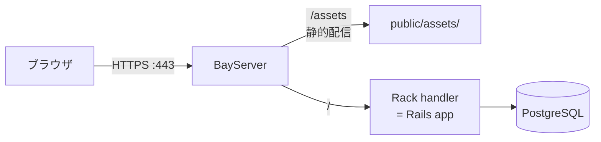

# Rails アプリをデプロイする

Ruby on Rails アプリケーションを BayServer (Ruby 版) で本番運用する例。Rack 連携 + 静的アセット最適化 + TLS 化までの完成形 `.plan`。

## 構成



## 前提

- Ruby 2.7.6 以降 + Rails アプリが既に動く状態
- `RAILS_ENV=production rails assets:precompile` 済み
- DB / 環境変数等は Rails 側で設定済
- BayServer Ruby 版を [インストール](../getting-started/install.md) 済

## ディレクトリ構成

Rails アプリのルート (= `config.ru`, `Gemfile` がある) を BayServer ホームから参照する想定です。実際にはシンボリックリンクや絶対パスで結ぶことも可:

```
<BayServerホーム>/
├── plan/bayserver.plan
├── cert/
│   ├── server.key
│   └── server.crt
└── apps/
    └── my-rails-app/    # = Rails アプリのルート (= config.ru がここ)
        ├── config.ru
        ├── Gemfile
        ├── app/
        ├── config/
        ├── public/
        │   ├── assets/  # = precompiled assets
        │   └── ...
        └── ...
```

## `.plan` 完成形

```
[harbor]
    charset UTF-8
    grandAgents 4
    maxShips 10000
    logLevel warn

[port 80]
    # HTTP → HTTPS リダイレクト用 (= 後述)

[port 443]
    enableH2 on
    [secure]
        key  cert/server.key
        cert cert/server.crt

[city *]
    # 静的アセットは BayServer から直接 (= Rack を経由しない)
    [town /assets]
        location apps/my-rails-app/public/assets

    [town /packs]
        location apps/my-rails-app/public/packs   # = Webpacker 使ってる場合

    # /robots.txt や /favicon.ico も静的
    [town /robots.txt]
        location apps/my-rails-app/public

    [town /favicon.ico]
        location apps/my-rails-app/public

    # それ以外は Rack 経由で Rails が処理
    [town /]
        location apps/my-rails-app
        [club *]
            docker rack

[log log/access.log]
    format %h %l %u %t "%r" %>s %b
```

ポイント:

- **`town /assets` を先に書く** → 静的アセットのリクエストは Rack を経由せずに BayServer が直接配信、爆速
- **`town /` の `docker rack`** で Rack インタフェース経由で Rails が動作 (= `config.ru` が呼ばれる)
- `enableH2 on` で HTTP/2 化、TLS handshake のコストが多数のアセット読込で分散

## 起動順

```bash
# 1. Rails 側の準備
cd apps/my-rails-app
RAILS_ENV=production bundle install --without development test
RAILS_ENV=production bundle exec rake assets:precompile
RAILS_ENV=production bundle exec rake db:migrate

# 2. 環境変数を BayServer プロセスに渡せる方法で設定
export RAILS_ENV=production
export SECRET_KEY_BASE="..."
export DATABASE_URL="..."

# 3. BayServer 起動
cd <BayServerホーム>
bin/bayserver.sh -start
```

## HTTP → HTTPS リダイレクト

`[port 80]` で受けたリクエストを HTTPS に飛ばしたい場合:

```
[port 80]

[city *]
    [trouble]
        # 詳細は別途
```

または、シンプルにアプリ側 (= Rails の `config.force_ssl = true`) で対応する方法もあります。

## マルチコアモード

```
[harbor]
    multiCore on
    grandAgents 4
```

Rails の Rack ハンドラがスレッドセーフであれば `multiCore on` で性能アップ。`config/puma.rb` などの設定との整合性に注意 (= 同時実行性 / DB コネクションプール数)。

## ログとアクセス記録

```
[harbor]
    logLevel warn        # 本番では warn 推奨 (= info はアクセスログでオーバヘッド)

[log log/access.log]
    format %h %l %u %t "%r" %>s %b
```

Rails 側のログ (`log/production.log`) と分けて管理すると追跡しやすい。

## 環境ごとの `.plan` 切替

開発 / staging / 本番で同じ `.plan` を共有するのは難しいので、`-plan` オプションで切替:

```bash
bin/bayserver.sh -start -plan plan/bayserver-production.plan
```

## ハマりがちな点

| 症状 | 対処 |
|---|---|
| 静的アセットが 404 | `bundle exec rake assets:precompile` 済か確認、`public/assets/` の存在確認 |
| `relative_url_root` が効かない | Rails の `config.relative_url_root` と BayServer の `town` パスを一致させる |
| Asset の MIME type が application/octet-stream | `harbor` の `charset` 設定、town の Club Docker 設定確認 |
| Cookie の Secure flag が立たない | TLS 終端した上で `X-Forwarded-Proto` がアプリに渡るか確認 (= 通常自動) |
| WebSocket / ActionCable | HTTP/1.1 Upgrade ベースなら動くが、本格運用は別途 ActionCable サーバ立てて FCGI/AJP では避ける |

## DB マイグレーションのタイミング

BayServer 自体は再起動で `.plan` を読み直すだけ。Rails のマイグレーションは別途 `rake db:migrate` を実行する運用にします。zero-downtime にしたい場合は別途仕組みが必要 (= スタンバイ DB / blue-green 等)。

---

## 関連

- [Ruby 版 BayServer](../languages/ruby.md)
- [リバースプロキシ](../guide/reverse-proxy.md) — Rack ではなく外部 Puma を立てて繋ぐパターン
- [HTTPS / TLS の設定](../guide/https.md)
- [パフォーマンス Tuning](../performance/tuning.md)
