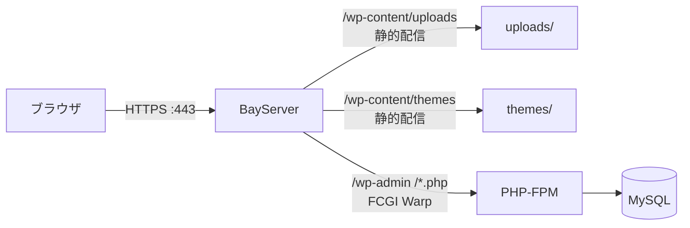

# WordPress を完全構成で動かす

WordPress を「ちゃんと運用できる構成」で BayServer 経由で動かす完成形。TLS + HTTP/2 + 静的アセット最適化 + Let's Encrypt 連携まで含む。

## 構成



PHP 処理は PHP-FPM が担当 (= BayServer 自体は PHP インタプリタを内蔵しない構成、Java 版でも Ruby 版でも使えるパターン)。

## 前提

- BayServer (Java / Ruby / Python / TypeScript / Go 版どれでも可)
- PHP-FPM 8.x 以降
- MySQL / MariaDB
- ドメインに DNS が当たっていて Let's Encrypt 証明書が取得可能

## ディレクトリ構成

```
<BayServerホーム>/
├── plan/bayserver.plan
└── (= cert は /etc/letsencrypt/ を参照)

/srv/wordpress/
├── index.php
├── wp-config.php
├── wp-content/
│   ├── uploads/        # 画像等
│   ├── themes/
│   └── plugins/
├── wp-admin/
└── wp-includes/
```

## PHP-FPM の設定

`/etc/php/8.x/fpm/pool.d/www.conf` で UDS リッスン:

```
listen = /run/php/php8.x-fpm.sock
listen.owner = www-data
listen.group = www-data
listen.mode = 0660
```

`/etc/php/8.x/fpm/php.ini` で:

```ini
memory_limit = 256M
upload_max_filesize = 64M
post_max_size = 64M
opcache.enable = 1
opcache.memory_consumption = 256
opcache.validate_timestamps = 0    # = 本番のみ。dev では 1 に
```

```bash
sudo systemctl restart php8.x-fpm
```

## Let's Encrypt で証明書を取得

```bash
sudo apt install certbot
sudo certbot certonly --standalone -d wp.example.com
```

= `/etc/letsencrypt/live/wp.example.com/{privkey,fullchain}.pem` が生成される。

BayServer が読めるように:

```bash
sudo chmod -R 755 /etc/letsencrypt/live/
sudo chmod -R 755 /etc/letsencrypt/archive/
sudo usermod -a -G ssl-cert <BayServer 起動ユーザ>
```

## `.plan` 完成形

```
[harbor]
    charset UTF-8
    grandAgents 4
    maxShips 10000
    logLevel warn

[port 80]

[port 443]
    enableH2 on
    [secure]
        key  /etc/letsencrypt/live/wp.example.com/privkey.pem
        cert /etc/letsencrypt/live/wp.example.com/fullchain.pem

[city wp.example.com]
    # 静的アセットは BayServer 直接配信 (= PHP-FPM を経由させない)
    [town /wp-content/uploads/]
        location /srv/wordpress/wp-content/uploads

    [town /wp-content/themes/]
        location /srv/wordpress/wp-content/themes

    [town /wp-content/plugins/]
        location /srv/wordpress/wp-content/plugins

    [town /wp-includes/]
        location /srv/wordpress/wp-includes

    # それ以外は WordPress Docker で URL rewrite + PHP 実行
    [town /]
        location /srv/wordpress

        [reroute]
            docker wordpress    # = .htaccess の rewrite 相当

        [club *.php]
            docker fcgiWarp
            destCity :unix:/run/php/php8.x-fpm.sock

# www. 以外で来たら wp.example.com にリダイレクト
[city *]
    [town /]
        location /srv/wordpress       # fallback

[log /var/log/bayserver/access.log]
    format %h %l %u %t "%r" %>s %b
```

ポイント:

- **静的 town を先に書く** → `wp-content/uploads/` 配下の画像は PHP を経由せず直接配信
- **`reroute wordpress`** で WordPress 標準の URL リライト規則を適用 (= permalinks が動く)
- **`*.php` だけ FCGI Warp** → 動的処理だけ PHP-FPM に転送
- **UDS 接続** で TCP オーバヘッドを排除

## wp-config.php

DB 接続情報 + リバースプロキシ越しの HTTPS 判定:

```php
define('DB_NAME',     'wordpress');
define('DB_USER',     'wpuser');
define('DB_PASSWORD', '<...>');
define('DB_HOST',     'localhost');
define('DB_CHARSET',  'utf8mb4');

define('WP_HOME',    'https://wp.example.com');
define('WP_SITEURL', 'https://wp.example.com');

// 静的 uploads URL の base
define('WP_CONTENT_URL', 'https://wp.example.com/wp-content');

// reverse proxy 越しの HTTPS 判定
if (!empty($_SERVER['HTTP_X_FORWARDED_PROTO']) &&
    $_SERVER['HTTP_X_FORWARDED_PROTO'] === 'https') {
    $_SERVER['HTTPS'] = 'on';
}

// = 個別認証キー、ソルトの設定 ...
```

## 証明書の自動更新

`/etc/cron.d/certbot`:

```cron
0 3 * * * root certbot renew --quiet --post-hook "<BayServerホーム>/bin/bayserver.sh -restart"
```

= 毎朝 3 時に更新チェック、成功したら BayServer を再起動して新証明書を読み込み。

## 起動

```bash
sudo systemctl restart php8.x-fpm
bin/bayserver.sh -start
curl -I https://wp.example.com/
# HTTP/2 200
# x-powered-by: PHP/8.x
```

WordPress 管理画面 `https://wp.example.com/wp-admin/` でログインできれば成功。

## パフォーマンス対策

### Direct Boarding + Barge

巨大画像が多いサイト用に:

```
[harbor]
    directBoarding on
    maxDirectBoardings 10
    maxCargoSize 1100000
    maxCargoSizeSecure 1100000

[city wp.example.com]
    [town /wp-content/uploads/]
        location /srv/wordpress/wp-content/uploads
        [barge]
            capacity 200M       # = よく見られる画像をメモリ cache
```

詳細: [パフォーマンス Tips](../performance/tips.md)。

### opcache 確認

PHP-FPM の OPcache が効いているか:

```bash
curl https://wp.example.com/_check.php   # = phpinfo() を一時的に置いて確認
```

または `wp-cli` の opcache プラグインで確認。

## トラブルシューティング

| 症状 | 確認 |
|---|---|
| Permalink (= `/?p=123` 以外) が 404 | `[reroute] docker wordpress` が `[town /]` に含まれているか |
| 502 Bad Gateway | PHP-FPM の起動状態、UDS パス、`listen` の権限 |
| 画像がアップロードできない | `/srv/wordpress/wp-content/uploads/` の書込権限 (= PHP-FPM の実行ユーザ) |
| 「証明書が信頼できない」 | Let's Encrypt の `fullchain.pem` を使う (= `cert.pem` だと中間証明書が欠ける) |
| ログインループ (= リダイレクトが永遠) | `wp-config.php` の `$_SERVER['HTTPS']` 判定確認 |
| 管理画面の保存で 504 | PHP-FPM の `request_terminate_timeout`、BayServer の `timeout`、両方を上げる |

---

## 関連

- [WordPress を動かす (= ガイド)](../guide/wordpress.md) — シンプル版
- [HTTPS / TLS の設定](../guide/https.md)
- [Let's Encrypt](../guide/letsencrypt.md)
- [リバースプロキシ](../guide/reverse-proxy.md)
- [パフォーマンス Tips](../performance/tips.md)
