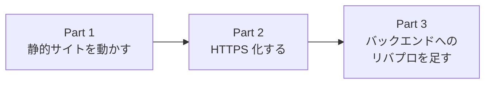

# チュートリアル

「**自分のサイトを動かす**」を BayServer で 3 ステップに分けて手を動かしながら学ぶ連続記事です。BayServer を一通り触ったことが無くても、この章を順に読んでいけば一通りの構成が組めるようになります。

## このチュートリアルで作るもの

最終的に、ローカル開発環境で:

- ポート 8080 で **静的サイト** を配信
- ポート 8443 で同じサイトを **HTTPS** 化
- `/api/*` のリクエストを **バックエンドアプリ (= 別ポートで動かす任意の HTTP サーバ)** にリバースプロキシ
- 全てを 1 つの `.plan` ファイルで設定

という構成が出来上がります。

## 進め方

各パートは前のパートの `.plan` をベースに少しずつ機能を足していく形式です。1 つずつ動作確認しながら進められます。

## パート一覧

1. [Part 1: 静的サイトを動かす](part1-static.md) — `harbor` / `port` / `city` / `town` の基本配置
2. [Part 2: HTTPS 化する](part2-https.md) — `secure` Docker と TLS 証明書
3. [Part 3: リバースプロキシを足す](part3-warp.md) — Warp Docker で別サーバに転送

## 前提

- [インストール](../install.md) が済んで `bin/bayserver.sh -start` で BayServer が起動する状態
- 任意のテキストエディタ
- (Part 2 以降) `openssl` コマンド
- (Part 3 のみ) 簡単に立てられるバックエンド (= Python の `http.server`、Node の `http`、別 BayServer など — 何でも可)

準備できたら [Part 1](part1-static.md) から始めましょう。
