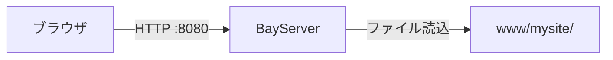

# Part 1: 静的サイトを動かす

最初は **HTML / CSS / 画像だけの静的サイト** を配信するところから始めます。

## 完成イメージ



ブラウザでアクセス → BayServer がディスクからファイルを読んで返す、というシンプルな構成です。

## 1. ディレクトリを作る

BayServer ホーム配下に作業ディレクトリを作ります。

```bash
cd <BayServerホーム>
mkdir -p www/mysite
```

## 2. コンテンツを置く

```bash
cat > www/mysite/index.html <<'EOF'
<!DOCTYPE html>
<html lang="ja">
<head><meta charset="UTF-8"><title>My BayServer Site</title></head>
<body>
  <h1>Hello, BayServer!</h1>
  <p>これは Part 1 で作った静的サイトです。</p>
</body>
</html>
EOF
```

## 3. `.plan` を書く

`plan/bayserver.plan` を開いて全文を以下に置き換えます (= バックアップを取っておくと安心):

```
[harbor]
    charset UTF-8
    grandAgents 4

[port 8080]

[city *]
    [town /]
        location www/mysite
        index    index.html
```

各 Docker の意味をざっと:

- **`[harbor]`** — サーバ全体の設定。`charset UTF-8` は日本語の文字化け防止
- **`[port 8080]`** — TCP 8080 番でリッスン
- **`[city *]`** — 任意のホスト名で受ける (= バーチャルホスト無し)
- **`[town /]`** — ルートパスの設定。`location` で物理ディレクトリを指定、`index` でディレクトリアクセス時の既定ファイル

## 4. 起動 & 確認

```bash
bin/bayserver.sh -start
```

別ターミナルで:

```bash
curl http://localhost:8080/
```

または ブラウザで `http://localhost:8080/` を開きます。`Hello, BayServer!` が見えれば成功。

## 5. 試しに小細工

### 別の URL でも見られるようにする

`town` を追加してみましょう。`/about` を作って別ページにします:

```bash
mkdir -p www/about
cat > www/about/index.html <<'EOF'
<!DOCTYPE html><html><body><h1>About</h1></body></html>
EOF
```

`.plan` を以下のように:

```
[harbor]
    charset UTF-8
    grandAgents 4

[port 8080]

[city *]
    [town /]
        location www/mysite
        index    index.html

    [town /about]
        location www/about
        index    index.html
```

再起動:

```bash
bin/bayserver.sh -restart
```

`http://localhost:8080/about/` でアバウトページが見られます。

### 試しにバーチャルホスト

`/etc/hosts` (Windows なら `C:\Windows\System32\drivers\etc\hosts`) に:

```
127.0.0.1 site-a.local
127.0.0.1 site-b.local
```

を追加。`.plan` を:

```
[port 8080]

[city site-a.local]
    [town /]
        location www/mysite

[city site-b.local]
    [town /]
        location www/about

[city *]
    [town /]
        location www/mysite     # fallback
```

`http://site-a.local:8080/` と `http://site-b.local:8080/` で違うサイトが見える状態に。

## 6. 停止

```bash
bin/bayserver.sh -stop
```

## まとめ

ここで覚えたこと:

- **`.plan` は Docker ブロックを縦に並べる**
- **`[city]` でバーチャルホスト、`[town]` で URL パスを区切る**
- 静的ファイル配信は `town` の `location` + `index` だけで OK
- 変更したら `-restart` で反映

詳細な `.plan` 文法は [リファレンス](../../reference/plan-syntax.md) を参照。

---

## 次は

[Part 2: HTTPS 化する →](part2-https.md)

Part 2 では、ここで作った静的サイトを **HTTPS** で配信できるようにします。
