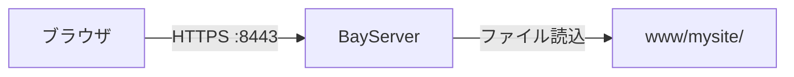

# Part 2: HTTPS 化する

[Part 1](part1-static.md) で作った静的サイトを、開発用の自己署名証明書で **HTTPS** 化します。

## 完成イメージ



ポート 8443 で TLS 終端、内部の流れは Part 1 と同じ。

## 1. 自己署名証明書を作る

`openssl` で開発用の鍵 + 自己署名証明書を作成します (= 本番は [Let's Encrypt](../../guide/letsencrypt.md))。

```bash
cd <BayServerホーム>
mkdir -p cert
cd cert

# 秘密鍵
openssl genrsa -out dev.key 2048

# 証明書署名要求 (= CSR)。対話的に組織情報を聞かれるが、全部 Enter で空欄でも開発用なら OK
openssl req -new -key dev.key -out dev.csr -subj "/CN=localhost"

# 自己署名
openssl x509 -req -days 365 -in dev.csr -signkey dev.key -out dev.crt

# 一覧確認
ls
# dev.crt  dev.csr  dev.key
```

## 2. `.plan` を更新

Part 1 の `.plan` に `[port 8443]` + `[secure]` ブロックを追加します:

```
[harbor]
    charset UTF-8
    grandAgents 4

[port 8080]

[port 8443]
    [secure]
        key  cert/dev.key
        cert cert/dev.crt

[city *]
    [town /]
        location www/mysite
        index    index.html
```

ポイント:

- **`[secure]` は `[port]` の子ブロック** (= インデント深く)
- 8080 はそのまま残しているので **HTTP / HTTPS 両方の URL で同じサイト** にアクセスできる
- `[city]` ブロックは port 毎に複製しなくてよい (= 全 `[port]` で共有される)

## 3. 起動 & 確認

```bash
bin/bayserver.sh -restart
```

ブラウザで `https://localhost:8443/` を開くと、**「信頼できない証明書」警告** が出ます (= 自己署名なので当然)。詳細から「危険を承知で進む」を押すとサイトが見られます。

`curl` で確認するなら `-k` (= 証明書検証スキップ):

```bash
curl -k https://localhost:8443/
```

## 4. HTTP/2 を有効化

TLS 上で HTTP/2 を有効にするのは 1 行追加で済みます:

```
[port 8443]
    enableH2 on
    [secure]
        key  cert/dev.key
        cert cert/dev.crt
```

再起動して、ブラウザの DevTools の Network タブで Protocol カラムを見ると `h2` と表示されるはずです。

## 動作確認まとめ

ここまでで作った状態:

| URL | 結果 |
|---|---|
| `http://localhost:8080/` | HTTP/1.1 で静的サイト |
| `https://localhost:8443/` | HTTPS (TLS) で静的サイト |
| `https://localhost:8443/` (= HTTP/2 対応 ブラウザ) | HTTP/2 で配信 |

## 本番では

開発用の自己署名証明書は **本番では NG** です (= 警告で離脱される)。実運用では [Let's Encrypt](../../guide/letsencrypt.md) で無料証明書を取得してください。手順:

```bash
sudo apt install certbot
sudo certbot certonly --standalone -d www.example.com
```

取得した証明書 (= `/etc/letsencrypt/live/www.example.com/`) を `.plan` の `key` / `cert` に指定するだけ。

詳細: [HTTPS / TLS の設定](../../guide/https.md), [Let's Encrypt](../../guide/letsencrypt.md)

---

## 次は

[Part 3: リバースプロキシを足す →](part3-warp.md)

Part 3 では、別のポートで動かしたバックエンドアプリ (= 任意の HTTP サーバ) に `/api/*` を転送する構成を追加します。
