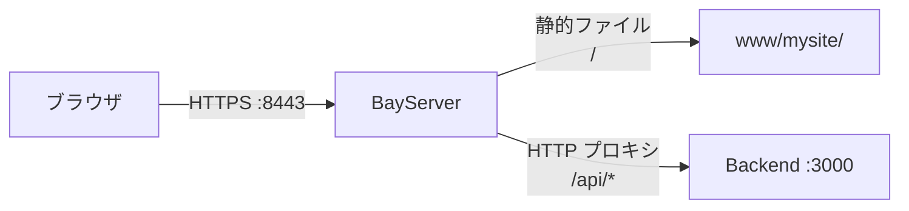

# Part 3: リバースプロキシを足す

[Part 2](part2-https.md) までで静的サイトを HTTP + HTTPS で配信できる状態になりました。最後に、**`/api/*` のパスだけ別サーバへ転送する** リバースプロキシ構成を足して完成です。

## 完成イメージ



`/` は今まで通り静的ファイル、`/api/*` だけ Backend (= 別ポートの HTTP サーバ) に転送します。

BayServer ではリバースプロキシに **Warp** という Docker を使います。受け取ったリクエストを別のサーバへ“ワープ”させるイメージです。転送プロトコルとして **HTTP / AJP / FCGI** をサポートしており、それぞれ `httpWarp` / `ajpWarp` / `fcgiWarp` として使い分けます。

## 1. バックエンドを用意

何でもよいので、簡単に HTTP を喋るものを 3000 番で動かします。

=== "Python"

    ```bash
    cat > /tmp/backend.py <<'EOF'
    from http.server import HTTPServer, BaseHTTPRequestHandler
    import json

    class H(BaseHTTPRequestHandler):
        def do_GET(self):
            self.send_response(200)
            self.send_header('Content-Type', 'application/json')
            self.end_headers()
            self.wfile.write(json.dumps({"path": self.path, "from": "backend"}).encode())

    HTTPServer(('127.0.0.1', 3000), H).serve_forever()
    EOF
    python3 /tmp/backend.py &
    ```

=== "Node.js"

    ```bash
    cat > /tmp/backend.js <<'EOF'
    require('http').createServer((req, res) => {
      res.setHeader('Content-Type', 'application/json');
      res.end(JSON.stringify({path: req.url, from: 'backend'}));
    }).listen(3000);
    EOF
    node /tmp/backend.js &
    ```

=== "別の BayServer インスタンス"

    別のディレクトリで Part 1 同様に BayServer を立て、`[port 3000]` でリッスンさせる。

動作確認:

```bash
curl http://127.0.0.1:3000/hello
# {"path": "/hello", "from": "backend"}
```

## 2. `.plan` に Warp Docker を足す

Part 2 の `.plan` に `[town /api]` ブロックを追加します:

```
[harbor]
    charset UTF-8
    grandAgents 4

[port 8080]

[port 8443]
    enableH2 on
    [secure]
        key  cert/dev.key
        cert cert/dev.crt

[city *]
    [town /]
        location www/mysite
        index    index.html

    [town /api]
        [club *]
            docker httpWarp
            destCity 127.0.0.1
            destPort 3000
            destTown /
```

ポイント:

- **`[town /api]` は `[town /]` より下に書く必要は無い** が、可読性のため後ろに置くのが慣習
- **`[club *]`** で `/api` 以下のすべてのリクエストを Warp Docker が受ける
- **`docker httpWarp`** で HTTP プロトコルでバックエンドに転送
- **`destCity 127.0.0.1` + `destPort 3000`** が転送先
- **`destTown /`** で「`/api` プレフィックスを取り除いて」転送 (= `/api/hello` → `/hello`)

## 3. 動作確認

```bash
bin/bayserver.sh -restart
```

静的サイトとプロキシを両方確認:

```bash
# 静的 (= Part 1 と同じ動き)
curl http://localhost:8080/
# <h1>Hello, BayServer!</h1> ...

# プロキシ経由 (= バックエンドの JSON)
curl http://localhost:8080/api/hello
# {"path": "/hello", "from": "backend"}

# HTTPS でも同様
curl -k https://localhost:8443/api/hello
```

## 4. UDS (= Unix Domain Socket) で接続

ローカル接続なら TCP より Unix ドメインソケットの方が高速です。バックエンドを UDS で listen させて、`.plan` を:

```
[town /api]
    [club *]
        docker httpWarp
        destCity :unix:/tmp/backend.sock
        destTown /
```

詳細: [リバースプロキシ](../../guide/reverse-proxy.md)。

## 5. プロトコルバリエーション

`httpWarp` 以外にも:

- **`ajpWarp`** — Tomcat と AJP で接続したい場合
- **`fcgiWarp`** — PHP-FPM や uWSGI と FCGI で接続したい場合

`destCity` / `destPort` の指定は同じ。

```
[club *.php]
    docker fcgiWarp
    destCity :unix:/run/php/php8-fpm.sock
```

詳細: [リバースプロキシ](../../guide/reverse-proxy.md)、[Docker 種別 / Warp Docker](../../reference/plan-reference.md#warp-docker-http-ajp-fcgi)。

## チュートリアル完了

ここまでで以下が動く `.plan` ができました:

- ✓ HTTP / HTTPS 両対応
- ✓ HTTP/2 多重化
- ✓ 静的配信 + リバースプロキシの混在
- ✓ バーチャルホスト相当

これが BayServer での **典型的な構成パターン**です。あとは用途に応じて部品を入れ替えるだけ:

- 静的の代わりに [PHP / WordPress / Servlet](../../languages/index.md) を実行
- プロキシ先を [本物のアプリサーバ](../../guide/reverse-proxy.md) に
- [アクセス制限](../../guide/access-control.md) を `town` 単位で追加
- [HTTP/3](../../guide/http3.md) を有効化

## 次のステップ

| 興味 | 行き先 |
|---|---|
| PHP / WordPress を動かす | [WordPress を動かす](../../guide/wordpress.md) |
| Rails / Django をフロントに置く | [リバースプロキシ](../../guide/reverse-proxy.md) + 各[言語別](../../languages/index.md) |
| 本番運用の tuning | [パフォーマンス](../../performance/index.md) |
| BayServer 自体を拡張 | [開発者向け](../../developer/index.md) |
| 用語を確認 | [用語集](../../reference/glossary.md) |

お疲れさまでした。
