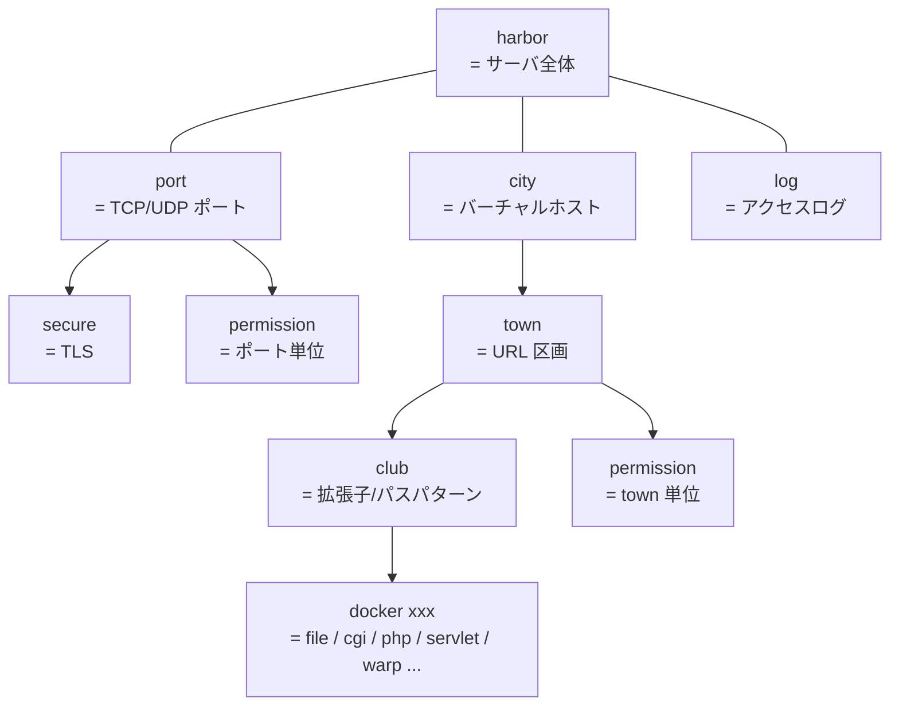

# 設計ファイル (.plan) リファレンス

BayServer の設定ファイル (= **設計ファイル / `.plan`**) のリファレンスです。書式と、構成要素である **Docker** の全種類・パラメータをまとめます。`.plan` は Windows の ini ファイルに近いシンプルな書式で、Docker と呼ばれるブロックを縦に並べて構成します。

!!! note "全言語実装で共通"
    `.plan` の文法は Java / Ruby / Python / PHP / TypeScript / Go の **全ての BayServer 実装で同一** です。同じ `.plan` ファイルを別言語の実装に渡しても (= 言語固有 docker のみ違いを吸収すれば) そのまま動作します。

## 場所

デフォルトは BayServer ホーム配下の `plan/bayserver.plan`。起動時の `-plan` オプションで別ファイルを指定できます:

```bash
bin/bayserver.sh -start -plan path/to/custom.plan
```

## 基本構造

```
[harbor]
    charset UTF-8
    timeout 30

[port 2020]
    timeout 10

[city www.baykit.yokohama]
    [town /]
        location www/root
        index    index.php
        [club *.php]
            docker php

[log log/access.log]
    format %h %l %u %t "%r" %>s %b
```

### Docker ブロック

`[<タイプ> <識別子>]` の形式で各 Docker を宣言します。例えば `[port 2020]` は「2020 番ポートを開く Port Docker の宣言」です。

### パラメータ

ブロック内の各行は **「名前 値」** をスペース区切りで書きます。

```
charset UTF-8
timeout 30
```

- 名前と値は **半角スペース** で区切る (= 全角スペース / タブは認識されないので注意)
- 名前は大文字小文字を区別しない (`charset` / `CharSet` / `CHARSET` は同じ)
- 値の解釈は Docker / パラメータごとに異なります (= 下記 [Docker 種別](#docker-種別) 参照)

### インデント

ブロックの所属はインデントで示します:

```
[harbor]
    charset UTF-8
    timeout 30
```

- インデント幅は **任意** (= 2 スペース / 4 スペースなど、好み)
- 同一ブロック内では **インデント幅を揃える**
- **全角スペース / タブは使わない** (= 必ず半角スペース)

### ネスト

Docker は階層構造で書けます:

```
[city www.baykit.yokohama]
    [town /]
        location www/root
        index    index.php
        [club *.php]
            docker php
```

子ブロックは親より深くインデントします。

### コメント

`#` で始まる行はコメント:

```
[city www.example.com]
# ここはコメント
    [town /]
        # この行もコメント
        location www/root
```

空白だけの行は無視されます。

## Docker 階層

主要な Docker は以下の階層を取ります:



テキスト表現でも同等:

```
harbor                   (= サーバ全体)
port (port number)       (= TCP/UDP ポート)
    secure               (= TLS)
    permission           (= IP / ホスト制限)
city (host name or *)    (= バーチャルホスト)
    town (URL path)      (= URL 区画)
        club (pattern)   (= 拡張子 / パスパターン)
            docker xxx   (= file / cgi / php / servlet / warp / …)
        permission       (= path 単位の制限)
log (log file path)      (= アクセスログ)
```

各 Docker の役割と全パラメータは下記 [Docker 種別](#docker-種別) を参照。

## よく使う設定例

### 静的ファイルだけ配信

```
[harbor]
    charset UTF-8

[port 8080]

[city *]
    [town /]
        location www/root
        index    index.html
```

### PHP ファイルを動的実行

```
[city *]
    [town /]
        location www/root
        index    index.php
        [club *.php]
            docker php
```

### バーチャルホスト

```
[city www.example.com]
    [town /]
        location /srv/example/www

[city blog.example.com]
    [town /]
        location /srv/blog/www

[city *]
    [town /]
        location www/default
```

`*` はワイルドカードで「他の city にマッチしない全てのホスト」を意味します。

### リバースプロキシ

```
[city *]
    [town /api]
        [club *]
            docker httpWarp
            destCity backend.internal
            destPort 8080
            destTown /api
```

詳細は [ガイド / リバースプロキシ](../guide/reverse-proxy.md)。

## 引用符と特殊文字

文字列値にスペースを含めたい場合はダブルクォートで囲みます:

```
format "%h %l %u %t \"%r\" %>s %b"
```

---

## Docker 種別

**Docker** とは、港湾従事者 (= 比喩) を抽象化した設定ブロックの単位です。種類ごとに役割が違い、`.plan` の中で組み合わせて使います。

!!! note
    仮想コンテナの Docker (= Docker, Inc.) とは無関係です。

### 大分類

| Docker | 役割 (= 港湾の喩え) | 実際の機能 |
|---|---|---|
| **Harbor** | 港湾全体の取りまとめ | サーバ全体の設定 (タイムアウト、スレッド数 等) |
| **Port** | 船舶を留める港 | TCP/UDP リッスンポート、プロトコル設定 |
| **Secure** | 通信暗号 / 解読 | SSL/TLS |
| **Permission** | 入国審査 | IP / ホスト制限、Basic 認証 |
| **Log** | 入国記録 | アクセスログ |
| **Reroute** | 行先変更 | URL Rewriting |
| **City** | 都市 | バーチャルホスト |
| **Town** | 街区 | URL パス区画 |
| **Club** | クラブ / 店 | 拡張子ハンドラ (= File / CGI / PHP / Servlet / Warp ...) |
| **Trouble** | 問題時の対処 | HTTP エラー時の代替挙動 |

### パラメータの型

各 Docker のパラメータは以下の型のいずれか:

- **String** — 任意の文字列。スペースを含むならダブルクォート
- **Integer** — 整数
- **Boolean** — `on` / `off` / `true` / `false` / `yes` / `no` のいずれか (= 全部同じ意味)
- **Multiplexer Type** — `spider` / `spin` / `pigeon` / `taxi` / `train` / `job` のいずれか

#### Multiplexer Type

I/O 多重化方式の指定。Docker (= 主に Harbor) で `netMultiplexer` などのパラメータに渡します。

| 値 | 説明 |
|---|---|
| `spider` | epoll / kqueue ベース。ノンブロッキング、最高性能 (= 推奨デフォルト) |
| `spin` | スピンロックで I/O 待ち |
| `pigeon` | 言語固有の async I/O ライブラリを利用 |
| `taxi` | スレッドプール |
| `train` | キュー & コンシューマ |
| `job` | OS スレッド 1 接続 = 1 スレッド |

詳細は [Multiplexer の役割](../architecture/index.md) (TBD) を参照。

### Harbor Docker

サーバ全体の設定。`.plan` に 1 つだけ存在。

```
[harbor]
    charset UTF-8
    maxShips 1024
    logLevel info
    multiCore on
    grandAgents 4
    traceHeader on
```

| パラメータ | 意味 |
|---|---|
| `charset` | 静的ファイル (text/*) を送信するときの Content-Type charset。日本語サイトなら必須 (= `UTF-8` 等) |
| `maxShips` | 最大同時接続数 |
| `logLevel` | `trace` / `debug` / `info` / `warn` / `error` / `fatal` |
| `multiCore` | マルチコアモード ON/OFF |
| `grandAgents` | ワーカースレッド数 (= CPU コア数程度推奨) |
| `traceHeader` | リクエスト/レスポンスヘッダをログ出力 |
| `socketTimeoutSec` | ソケット I/O のタイムアウト (秒) |
| `tourBufferSize` / `shipBufferSize` | バッファサイズ |
| `redirectFile` | 標準出力 / エラー出力をファイルへ |
| `netMultiplexer` | ネットワーク I/O の Multiplexer Type |

### Port Docker

リッスンポートの宣言。

```
[port 2020]
    timeout 10
```

| パラメータ | 意味 |
|---|---|
| `docker` | `http` (デフォルト) / `ajp` / `fcgi` のいずれか |
| `timeout` | 接続単位のタイムアウト (秒) |
| `address` | バインドアドレス。省略時は全 IF |

ネストできる子 Docker: `secure` / `permission`。

#### HTTP Port

省略時のデフォルト。HTTP/1.1 と (Secure と組み合わせれば) HTTP/2 / HTTP/3 を扱います。

| 追加パラメータ | 意味 |
|---|---|
| `enableH2` | HTTP/2 の許可 (= ALPN で握る) |
| `enableH3` | HTTP/3 (QUIC) の許可 |

#### AJP Port / FCGI Port

それぞれ `docker ajp` / `docker fcgi` を指定。Apache や Nginx のバックエンドとして BayServer を使う場合に使用。

### Secure Docker

Port Docker の子として配置 → そのポートを TLS 化。

```
[port 2024]
    [secure]
        key  cert/oreore.key
        cert cert/oreore.crt
```

| パラメータ | 意味 |
|---|---|
| `key` | 秘密鍵ファイルへのパス (BayServer ホーム相対 or 絶対) |
| `cert` | 証明書ファイルへのパス |
| `keyStore` | Java 用 keystore ファイル (jks / pkcs12) |
| `keyStorePass` | keystore のパスワード |
| `traceSSL` | SSL ハンドシェイクをログ |

詳細: [HTTPS / TLS の設定](../guide/https.md)。

### City Docker

バーチャルホスト宣言。

```
[city www.example.com]
    ...

[city *]    # 他のどの city にもマッチしない場合の fallback
    ...
```

子 Docker: `town`, `permission`, `log`, `reroute`, `trouble`。

### Town Docker

city 内の URL パス区画。

```
[town /]
    location www/root
    index    index.html
```

| パラメータ | 意味 |
|---|---|
| `location` | このパスに対応する物理ディレクトリ |
| `index` | ディレクトリへのリクエストで返すデフォルトファイル |
| `welcomeFile` | 同上 (古い別名) |

子 Docker: `club`, `permission`, `reroute`。

### Club Docker

ファイル / リクエストパターンに対するハンドラ。

```
[club *.php]
    docker php
```

| パラメータ | 意味 |
|---|---|
| `docker` | ハンドラの種類: `file` / `cgi` / `php` / `servlet` / `httpWarp` / `ajpWarp` / `fcgiWarp` / `wordpress` |
| `charset` | 文字エンコーディング |

#### File (デフォルト) — 静的ファイル配信

`docker file` または `docker` 行を省略するとファイル配信。

#### CGI Docker

```
[club *.cgi]
    docker cgi
    interpreter /usr/bin/perl
    timeout 30
```

| パラメータ | 意味 |
|---|---|
| `interpreter` | スクリプトを動かすインタプリタ |
| `timeout` | CGI プロセスのタイムアウト (秒) |
| `maxProcesses` | 最大プロセス数 |

#### PHP Docker (PhpCgi)

```
[club *.php]
    docker php
```

PHP-CGI を起動して `.php` を実行。`php-cgi` がパス上にあることが前提。

| パラメータ | 意味 |
|---|---|
| `phpCgi` | php-cgi のパス |
| `timeout` | タイムアウト (秒) |

#### Servlet / Rack / WSGI

Java / Ruby / Python 版固有の Club Docker。[言語別](../languages/index.md) を参照。

#### Warp Docker (HTTP/AJP/FCGI) { #warp-docker-http-ajp-fcgi }

別ホストへのリバースプロキシ。

```
[club *]
    docker httpWarp
    destCity backend.internal
    destPort 8080
    destTown /
```

| パラメータ | 意味 |
|---|---|
| `docker` | `httpWarp` / `ajpWarp` / `fcgiWarp` |
| `destCity` | 接続先ホスト (UNIX ソケットは `:unix:/path/to/sock`) |
| `destPort` | 接続先ポート (HTTP デフォルト 80) |
| `destTown` | 接続先パス |
| `maxShips` | 最大接続数 |
| `timeout` | タイムアウト (秒) |
| `secure` | (HTTP Warp のみ) 上流が TLS なら `on` |

詳細: [リバースプロキシ](../guide/reverse-proxy.md)。

#### WordPress Docker

```
[city wp.example.com]
    [town /]
        location /srv/wordpress
        [club *]
            docker wordpress
```

WordPress の URL リライト規則を内蔵した Club Docker。詳細: [WordPress を動かす](../guide/wordpress.md)。

### Permission Docker

IP/ホスト制限や Basic 認証。Port / City / Town にネスト可能。

```
[permission]
    admit 192.168.1.0/24
    refuse all
    user admin password=$2y$10$...
```

| パラメータ | 意味 |
|---|---|
| `admit` | 許可する IP / CIDR / ホスト名 |
| `refuse` | 拒否する IP / CIDR / ホスト名 |
| `group` | グループ宣言 |
| `user` | ユーザとパスワード (= Basic 認証) |

詳細: [アクセス制限](../guide/access-control.md)。

### Log Docker

```
[log log/access.log]
    format %h %l %u %t "%r" %>s %b
```

| パラメータ | 意味 |
|---|---|
| `format` | Apache 互換のログフォーマット文字列 |
| `roll` | ローテーション方式 |

### Reroute Docker

URL 書き換え。

```
[reroute]
    docker wordpress    # WordPress の標準書き換え規則を適用
```

または独自パターン。

### Trouble Docker

HTTP エラー時の処理。

```
[trouble]
    # エラー時に静的ファイルにフォールバック等
```

---

## 関連

- [用語集](glossary.md) — 港湾比喩 (harbor / port / city / town / club / …) と用語早見表
- [Hello World](../getting-started/hello-world.md) — 最初の `.plan` を書く
- [ガイド](../guide/index.md) — 実際の使用例
