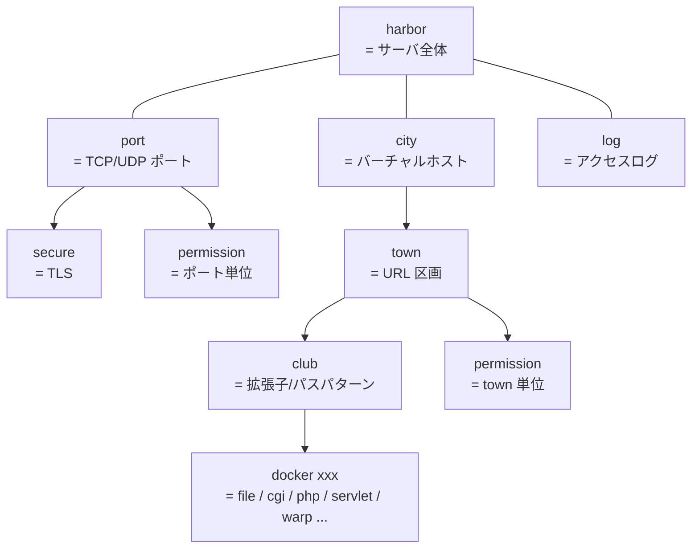

# `.plan` 文法

BayServer の設定ファイル (= **設計ファイル / `.plan`**) は Windows の ini ファイルに近いシンプルな書式です。Docker と呼ばれるブロックを縦に並べて構成します。

!!! note "全言語実装で共通"
    `.plan` の文法は Java / Ruby / Python / PHP / TypeScript / Go の **全ての BayServer 実装で同一** です。同じ `.plan` ファイルを別言語の実装に渡しても (= 言語固有 docker のみ違いを吸収すれば) そのまま動作します。

## 場所

デフォルトは BayServer ホーム配下の `plan/bayserver.plan`。起動時の `-plan` オプションで別ファイルを指定できます:

```bash
bin/bayserver.sh -start -plan path/to/custom.plan
```

## 基本構造

```
[harbor]
    charset UTF-8
    timeout 30

[port 2020]
    timeout 10

[city www.baykit.yokohama]
    [town /]
        location www/root
        index    index.php
        [club *.php]
            docker php

[log log/access.log]
    format %h %l %u %t "%r" %>s %b
```

### Docker ブロック

`[<タイプ> <識別子>]` の形式で各 Docker を宣言します。例えば `[port 2020]` は「2020 番ポートを開く Port Docker の宣言」です。

### パラメータ

ブロック内の各行は **「名前 値」** をスペース区切りで書きます。

```
charset UTF-8
timeout 30
```

- 名前と値は **半角スペース** で区切る (= 全角スペース / タブは認識されないので注意)
- 名前は大文字小文字を区別しない (`charset` / `CharSet` / `CHARSET` は同じ)
- 値の解釈は Docker / パラメータごとに異なる ([リファレンス](index.md) 参照)

### インデント

ブロックの所属はインデントで示します:

```
[harbor]
    charset UTF-8
    timeout 30
```

- インデント幅は **任意** (= 2 スペース / 4 スペースなど、好み)
- 同一ブロック内では **インデント幅を揃える**
- **全角スペース / タブは使わない** (= 必ず半角スペース)

### ネスト

Docker は階層構造で書けます:

```
[city www.baykit.yokohama]
    [town /]
        location www/root
        index    index.php
        [club *.php]
            docker php
```

子ブロックは親より深くインデントします。

### コメント

`#` で始まる行はコメント:

```
[city www.example.com]
# ここはコメント
    [town /]
        # この行もコメント
        location www/root
```

空白だけの行は無視されます。

## Docker 階層

主要な Docker は以下の階層を取ります:



テキスト表現でも同等:

```
harbor                   (= サーバ全体)
port (port number)       (= TCP/UDP ポート)
    secure               (= TLS)
    permission           (= IP / ホスト制限)
city (host name or *)    (= バーチャルホスト)
    town (URL path)      (= URL 区画)
        club (pattern)   (= 拡張子 / パスパターン)
            docker xxx   (= file / cgi / php / servlet / warp / …)
        permission       (= path 単位の制限)
log (log file path)      (= アクセスログ)
```

詳細な Docker 一覧と各パラメータは [Docker 種別](index.md) を参照。

## よく使う設定例

### 静的ファイルだけ配信

```
[harbor]
    charset UTF-8

[port 8080]

[city *]
    [town /]
        location www/root
        index    index.html
```

### PHP ファイルを動的実行

```
[city *]
    [town /]
        location www/root
        index    index.php
        [club *.php]
            docker php
```

### バーチャルホスト

```
[city www.example.com]
    [town /]
        location /srv/example/www

[city blog.example.com]
    [town /]
        location /srv/blog/www

[city *]
    [town /]
        location www/default
```

`*` はワイルドカードで「他の city にマッチしない全てのホスト」を意味します。

### リバースプロキシ

```
[city *]
    [town /api]
        [club *]
            docker httpWarp
            destCity backend.internal
            destPort 8080
            destTown /api
```

詳細は [ガイド / リバースプロキシ](../guide/reverse-proxy.md)。

## 引用符と特殊文字

文字列値にスペースを含めたい場合はダブルクォートで囲みます:

```
format "%h %l %u %t \"%r\" %>s %b"
```

---

## 関連

- [Docker 種別](index.md) — 各 Docker の役割とパラメータ
- [Hello World](../getting-started/hello-world.md) — 最初の `.plan` を書く
- [BayServer とは / 用語表](../about.md#1) — harbor / port / city / town … の比喩の由来
